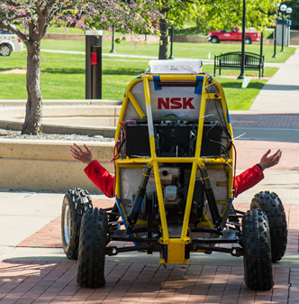

*****************************************************
ME 450 Project Requirements Spring 2017 - version #1
*****************************************************
The overarching goal of this project is to apply basic engineering knowledge to augment an autonomous baja ground vehicle platform so that it can be controlled autonomously using both steering and speed commands and add sensors to the vehicle that will allow the vehicle to perceive its environment and act accordingly. The project can be broken up into several tasks that are described below.

Design and Manufacture
########################
Systems to control vehicle throttle and brake
**********************************************
In this task, students will be required to apply basic knowledge of electro-mechanical systems to remotely control the position of the vehicle throttle. In doing this task, students will have to:
	* Select appropriate actuators (i.e. step motor, linear actuator, rotor motor). 		      	Considerations will include torque and speed requirements (which are also to be determined), 	safety, reliability and cost.
	* Determine actuator positions (after selecting one or more of the following; 	potentiometer, optical encoder, limit switch, etc.). Considerations for this task will include 	reliability, safety, and cost.
	* Design and manufacture (or purchase) brackets and mounts to support all of the devices 	used in both throttle and brake systems. A basic stress analysis on these systems should be 	performed and the entire system should be moderately resilient to the elements.

A mount to support a LiDAR device
**********************************
In this task students will be required to design and manufacture a mounting system for a LiDAR device (to be selected by sponsors).

	* Design and manufacture (or purchase) brackets and mounts to the LiDAR device.

Install GPS, IMU, Wheel Encoders, and Camera
In this task students will be required to design and manufacture a mounting system for a GPS, IMU wheel encoders, and camera devices (to be selected).

	* Design and manufacture (or purchase) brackets and mounts the sensors and devices.

Map steering wheel angle to angle of tire on ground
****************************************************
In this task students will be required to determine the relationship between the angle of the steering wheel and the angle of the tire at the ground.

Ensure that the following 10 states are accurately determined
***************************************************************
Global vehicle position (X, Y, Z), vehicle velocity (lateral and longitudinal), yaw rate, yaw angle, steering angle (at tire ground interface), steering rate (at tire ground interface), and longitudinal jerk.

	* Design and manufacture (or purchase) any additional sensors to accomplish this task.

Develop computer code to control the vehicle using steering angle and longitudinal speed
*******************************************************************************************
In this task, the students will be responsible for developing a rudimentary control algorithm (i.e. PID controller) to ensure that the vehicle can track predefined control signals.

	* Design and manufacture (or purchase) any additional sensors and electrical equipment to      	accomplish this task.

Develop computer code to record all data from sensors
********************************************************
In this task, the students will be responsible for developing a data acquisition system to record all of the  data and graph it (when appropriate) in real-time.
	* Design and manufacture (or purchase) any additional sensors and electrical equipment to      	accomplish this task.

Experimental Testing
######################

Testing Actuator Systems
***************************
	* Both the throttle and brake systems will be tested to ensure that the they can operate the 	vehicle controls as expected. To do this basic knowledge of control and coding will be applied.
	* Additionally, students will become familiar with the current steering wheel actuator 	system and if needed replace any electronic or mechanical components.

Testing Sensor and Remaining Electrical Systems
************************************************
	* The LiDAR device, GPS, IMU, wheel encoders, camera and any additional systems 	deemed necessary will be tested as well as data collecting and visualization software.
	* Refine electrical system as needed, this may include anything from purchasing additional 	sensors to installing wire shielding.

Remotely and Autonomously Control Vehicle
******************************************
	* For safety, the first series of test where the vehicle is being controlled remotely and with 	basic PID controller will be 	performed with the vehicle on an elevated platform (i.e. with the 	tires off of the ground).
	* This is the next set of tests where the vehicle is controlled remotely as it navigates in a 	designated area.
	* This is the next set of tests where the vehicle is controlled using the PID controller as it 	navigates in a 	designated area.

Current Platform:
###################
The current vehicle has and actuator on the vehicle to control steering and there is station that is capable of teleoperating the vehicle using a steering wheel attached to an actuator for haptic feedback. However, there are significant dropouts in the control signals and the system is very rudimentary. Therefore, this project will be responsible for addressing these issues and creating a platform that has the mechanical and electrical components needed for autonomous and teleoperated driving.

